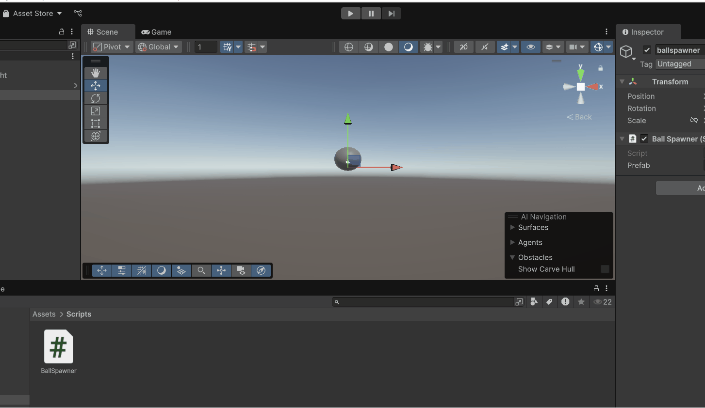
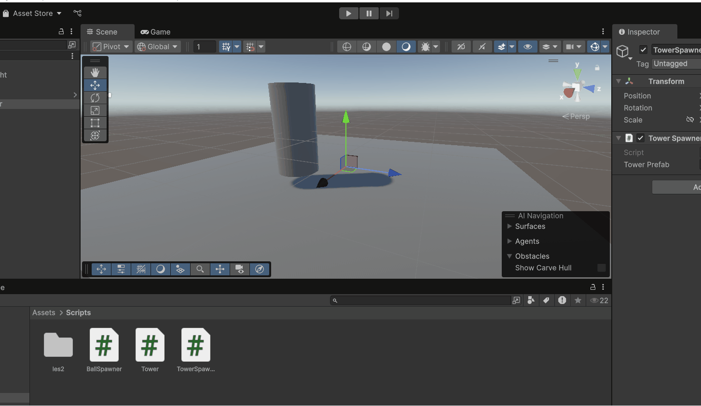
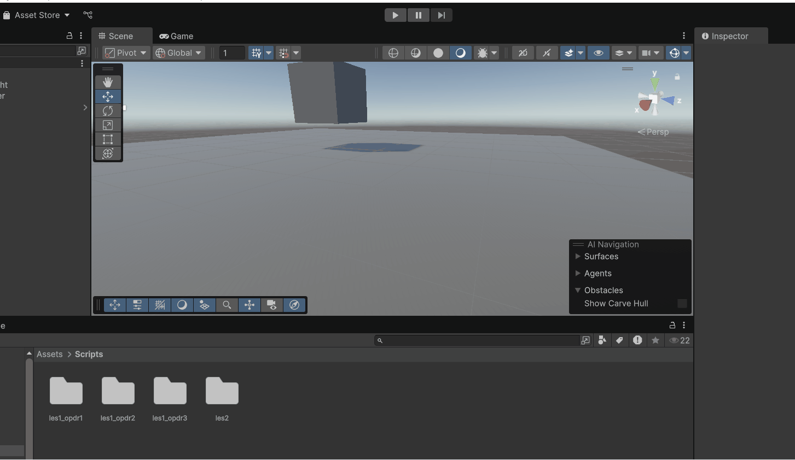
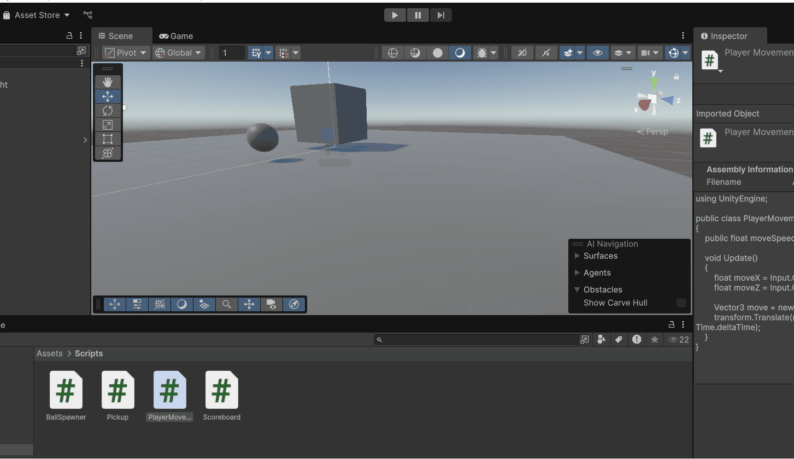
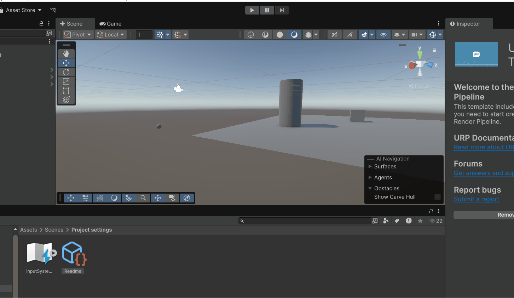

## hier komt nog tekst

### opdr 1 Herhaling

hier spawnen 100 ballen in verschillende kleuren.

### opdr 2 

hier spawnen cilinders als ik met mn linkermuisknop klik op het scherm

### opdr 3

hier spawnen meerdere enemys als ik op w klik en verdwijnen ze als ik op Q klik. ze spawnen alleen niet random wat wel volgens mij in de code staat.

### les 2 Action events

### opdr 3 
## ?

### opdr 4
#### link naar repo

### opdr 5

